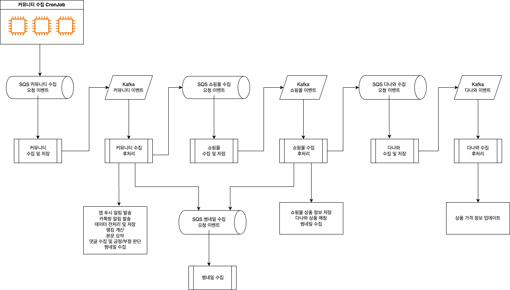

# 지름알림 수집 파이프라인

- SQS, Kafka, worker를 활용해 상품 정보를 수집하는 파이프라인입니다.
- 모든 수집은 URL을 포함한 SQS이벤트를 받아 처리합니다.
- 처리하는데 시간이 오래걸리는 작업들은 이벤트로 넘겨 병렬적으로 빠르게 수집될 수 있도록 합니다.
- 수집 요청에 대한 통로를 일원화해 여러 위치에서의 수집 요청을 대응할 수 있도록 합니다.
- 요청이 많아지더라도 워커를 병렬적으로 확장해 수집 속도를 조절할 수 있도록 합니다.
